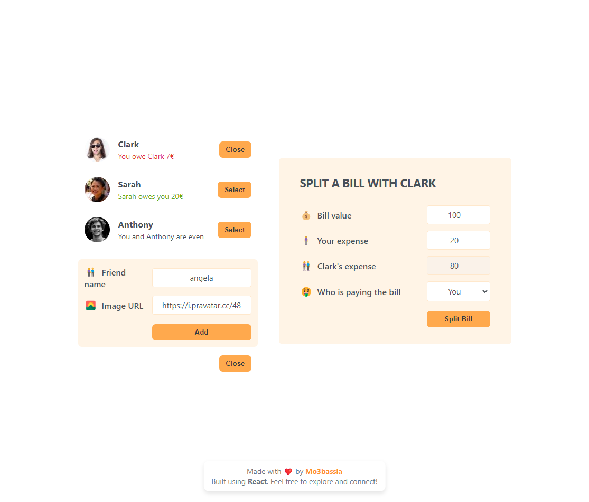

# Split Bill App 💸

Welcome to the Split Bill App! 🎉 This is a simple yet powerful React application that helps users manage their friends 👥 and effortlessly split bills 💰 among them. Perfect for group outings, shared expenses, and keeping track of who owes what! 🧾

## Features 🌟

- 🌟 **View Friends:** Display a list of friends with their names, images, and current balance owed. 👀
- ➕ **Add Friends:** Easily add new friends with a customizable name and image URL.
- ⚖️ **Split Bills:** Calculate and divide bills between yourself and a selected friend in a user-friendly interface.
- 🔄 **Dynamic Balance Update:** Automatically updates each friend's balance based on contributions, ensuring everyone knows their standing.
- 📱💻 **Responsive Design:** Works seamlessly on different screen sizes for both desktop and mobile users.

## Technologies Used 🛠️

- ⚛️ **React:** A JavaScript library for building user interfaces.
- 📦 **useState:** React Hook for managing state in functional components.
- 🎨 **CSS:** For styling the application, ensuring a clean and attractive look.

## Learning Journey 📚

This project marks the beginning of my journey in learning React. 🚀 I plan to explore more features such as:

- 🔐 **User Authentication:** Implement user accounts for personalized experience.
- 💾 **Persistent Data Storage:** Utilize local storage or a database for saving friend and bill data across sessions.
- ✨ **Enhanced UI/UX:** Focus on improving user interface and user experience for better interaction.
- 🔔 **Notifications:** Implement a notification system for bill reminders.

## Live Demo 🌐

- [Live Preview Here](https://dish-divide-mo3bassias-projects.vercel.app)
